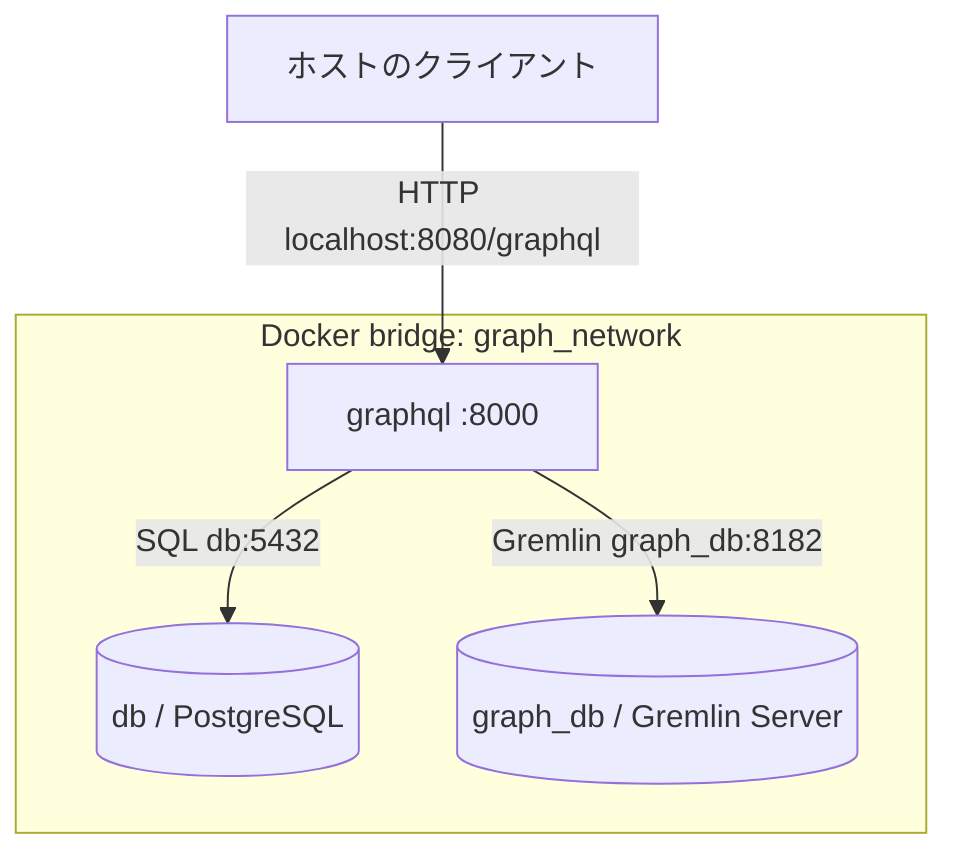

# アーキテクチャ：GraphQL時系列・グラフデータベース

| 項目 | 内容 |
|---|---|
| 文書版 | 0.8（合意した共通期間判定規則を追加） |
| 作成日 | 2026-09-22 |
| 状態 | 設計仕様。コンテナ・プログラムの実装と起動検証は未実施 |
| 対象 | 時系列値の検索と、データ間・所属関係の横断検索 |

この文書はリポジトリの基本設計を示す。実装を開始する人やAIエージェントは、まず「9. 実装時に守る前提」と「8. 次回以降に設計する事項」を確認する。コードやComposeファイルが未作成の状態では、記載した起動コマンドやクエリを動作確認済みと扱わない。

## 1. 目的と範囲

本システムの目的は、利用者がデータベース内部のテーブル構成やグラフの頂点・辺の構造を知らなくても、業務上の概念でデータを問い合わせられるようにすることである。たとえば「この設備に属する信号と、その期間の測定値」を一つのGraphQLクエリで取得できる。上位アプリケーションはSQLやGremlin、保存先の違いを意識せずに利用する。

設備・ライン・信号・アプリケーションの関係をたどれるようにし、設備の影響範囲の把握、関連データの発見、デジタルツインの試作など、関係付けを必要とするDX向けの用途に対応する。同時に、タグIDと時刻を軸に時系列値をPostgreSQLで管理する従来の方法を継承し、既存のデータや収集方式を活用しやすくする。関係情報をグラフデータベースに持たせ、時系列値との橋渡しをGraphQLのResolverが担う。

データベース内のテーブルやグラフの構造が変わっても、利用者に公開するGraphQLの型・フィールドと意味を維持できる場合は、主にResolverを改修して上位アプリケーションへの影響を抑える。公開する概念や意味自体を変える場合は、GraphQLスキーマと利用側の変更が必要になる。

本書は、この利用者向け検索を実現する読み取りAPI、データの役割分担および基本構成を定める。共通期間に必要なゲートウェイ側のデータ更新契約も定めるが、ゲートウェイ本体、データ収集経路、登録・更新API、認証、画面、実運用のバックアップ方式、グラフの本番永続化方式の実装設計は後続で決める。既存の「データ収集・メタデータ管理システム」仕様書とは別文書であり、収集機能をここで確定しない。

### 1.1 用語と責任分担

| データ | 保存先 | 例 | 識別方法 |
|---|---|---|---|
| 時系列値 | `db`（PostgreSQL） | 時刻、信号ID、値、品質 | `id` と `date_time` |
| 意味・関係 | `graph_db`（Gremlin Server） | 設備が信号を持つ、アプリが信号を使う | 頂点の業務ID `id` |
| 公開する検索モデル | `graphql`（FastAPI + Strawberry） | `Equipment.signals`、`Signal.data` | GraphQLスキーマとResolver |

グラフの`Signal.id`（タグID）とPostgreSQLの`signal_data.id`は同じ文字列を使う。Gremlin内部で自動採番される頂点IDはAPIの業務IDとして使わない。信号の名称はグラフの`Signal.name`だけに保持する。

## 2. ユースケース

| ID | 利用者の目的 | 入力 | 処理と結果 |
|---|---|---|---|
| UC-01 | 設備の信号を知る | 設備ID | グラフ上で設備の`hasSignal`先を探索し、信号のID・名前・単位を返す |
| UC-02 | 表示アプリに必要な信号を知る | アプリID | `Application -uses-> Signal`を探索し、表示対象を返す |
| UC-03 | 複数タグの共通区間候補を知る | タグID群、検索期間 | 全タグに共通する`GOOD`区間から、日本時間で丸ごと有効な暦日を連結して返す。詳細は6.4節 |
| UC-04 | 選択した期間の時系列値を読む | 信号ID群、開始・終了時刻 | PostgreSQLから各信号の点列を時刻順に返す |
| UC-05 | 設備と時系列値を一度に取得する | 設備ID、期間 | グラフから設備・信号を解決し、各信号の実測値をPostgreSQLから取得する |

表示アプリがある場合の基本的な順序は、**必要な信号の取得 → 表示可能期間の取得 → 期間・信号を指定した値の取得 → クライアント側で描画**とする。描画UI自体は本仕様の範囲外。

## 3. 論理モジュール構成

| モジュール | 配置 | 主な責務 |
|---|---|---|
| GraphQL HTTPサーバ | `graphql` | Uvicorn上のFastAPIで`/graphql`を公開、要求を受け付ける |
| GraphQLスキーマ／Resolver | `graphql` | Strawberryで型とQueryを定義し、問い合わせを各ストアへの検索に変換する |
| ゲートウェイ（本構成の外部） | 別途設計 | タグ別の記録周期・共通開始時刻の原本、予定時刻の欠測補完、品質・値・`GOOD`区間の更新 |
| Graphアクセス | `graphql` | Gremlinクライアントで`graph_db:8182`へ接続し、頂点・辺を探索する |
| 時系列アクセス | `graphql` | PostgreSQLクライアントで`db:5432`へ接続し、値・期間を取得する |
| 時系列データベース | `db` | 時系列値を永続化する |
| グラフデータベース | `graph_db` | Gremlin Server 3.8.1でグラフを保持・検索する。開発用バックエンドはTinkerGraphを想定 |

GraphQL APIは業務上の論理モデルを公開する。Gremlinの実際の辺の経路やPostgreSQLのテーブル構造はResolverが吸収する。外部クライアントにはSQLやGremlinの任意実行を公開しない。

## 4. 論理ネットワーク構成



| コンテナ名・サービス名 | 内部ポート | ホストへの公開 | ネットワーク |
|---|---:|---|---|
| `db` | 5432 | なし | `graph_network` |
| `graph_db` | 8182 | なし | `graph_network` |
| `graphql` | 8000 | `127.0.0.1:8080` → `8000` | `graph_network` |

3コンテナを同じ`graph_network`に参加させ、内部ではサービス名`db`／`graph_db`を接続先ホスト名にする。ゲートウェイは論理上の外部更新主体であり、PostgreSQLへの安全な書き込み経路（同一ネットワークへの参加または専用の書き込み口）は後続設計で決める。`graphql`のみ`ports`を設定する。`127.0.0.1`へのホスト側バインドはローカル開発の前提であり、外部公開する際のネットワーク・認証・TLSは別途設計する。ホスト側ポートはGremlinの標準的な`8182`とは区別して`8080`とする。

## 5. データモデルの初期案

### 5.1 PostgreSQL

| テーブル | 列 | 初期の意味 |
|---|---|---|
| `signal_data` | `id TEXT NOT NULL` | グラフの`Signal.id`と同じタグID |
|  | `date_time TIMESTAMPTZ NOT NULL` | 記録時刻。内部ではUTC基準で扱い、API応答時に日本時間へ変換 |
|  | `value DOUBLE PRECISION` | 数値。DI/DOは暫定的に0/1。非数値信号は後続設計 |
|  | `quality TEXT NOT NULL DEFAULT 'NA'` | `NA`（収集結果未確定）、`GOOD`（値あり・正常）、`BAD`（値なし・欠測／収集失敗） |
| `signal_coverage` | `id TEXT NOT NULL` | タグID |
|  | `start_time TIMESTAMPTZ NOT NULL` | 連続した`GOOD`区間の開始（包含） |
|  | `end_time TIMESTAMPTZ NOT NULL` | 連続した`GOOD`区間の終了（非包含） |

`signal_data`の主キーは`(id, date_time)`とする。`GOOD`の値は非NULL、`BAD`の値はNULLとする。`signal_coverage`はタグごとの重複しない正規化済み`GOOD`区間を保持し、ゲートウェイが値・品質と一体で更新する。グラフとの間にPostgreSQLの外部キー制約は張れないため、タグIDの対応は登録処理と定期照合で検証する。時刻範囲検索に主キーの同じ列順の索引を使う。時刻範囲は開始を含み終了を含まない`[from, to)`とする。保存期間・パーティション分割・取り込み方法は後続設計。

### 5.2 グラフ

| 頂点ラベル | 業務ID例 | 主な属性 |
|---|---|---|
| `Plant` | `P01` | `id`, `name` |
| `Line` | `L01` | `id`, `name` |
| `Equipment` | `Pump01` | `id`, `name` |
| `Signal` | `AI001` | `id`, `name`, `unit`, `dataType` |
| `Application` | `trend_app_01` | `id`, `name` |

| 始点 | 辺ラベル | 終点 | 意味 |
|---|---|---|---|
| Plant | `contains` | Line | ラインの所属 |
| Line | `contains` | Equipment | 設備の所属 |
| Equipment | `hasSignal` | Signal | 設備が持つ信号 |
| Application | `uses` | Signal | アプリが利用する信号 |

これは初期の概念モデルであり、登録データや頂点ID割当ての手順は後続設計。グラフ側に時系列値の全点を複製しない。

### 5.3 タグIDと信号名称の規則

- **`id`は信号のタグID**とする。グラフの`Signal.id`とPostgreSQLの`signal_data.id`には同じタグIDを格納し、内部の照合・時系列検索にはこのIDを用いる。名称は結合キーにしない。
- タグIDは対象システム内で信号を一意に特定できる必要がある。工場ごとに同じタグIDが存在する場合、システムへ登録する前に工場を含む識別方法を決める。既存の`AI001`などの例は、登録範囲内で一意である場合を示す。
- **`name`はグラフの`Signal.name`だけに置く表示用属性**とする。同じ名称が多数の信号に使われてもよく、変更も許す。PostgreSQLの`signal_data`には名称列を設けない。
- GraphQLで`id`や`data`だけを要求された場合、名称は取得・返却しない。上位アプリケーションが`name`フィールドを要求したときにグラフから返す。グラフで信号を探索する際は、同じ探索で要求された`name`を一括取得できるようにする。
- タグIDを使って両データベースを結ぶので、グラフ上のタグIDと時系列データのタグIDについて、未登録・孤立・重複を検出する整合性検査を設ける。検査の実行時期と処理方針は後続設計で決める。

## 6. 外部仕様：GraphQL

### 6.1 エンドポイントと初期スキーマ案

`POST http://localhost:8080/graphql`にJSON形式の`{"query":"...","variables":{...}}`を送る。以下のSDLは公開契約の設計案であり、具体的なPython定義と入出力検証は実装時に確定する。日時入力はオフセット付きISO 8601（`Z`または`+09:00`など）で受け取りUTCに正規化する。日時を含むGraphQL応答は日本時間`+09:00`のISO 8601で返す。

```graphql
type Query {
  equipment(id: ID!): Equipment
  application(id: ID!): Application
  signalRange(signalIds: [ID!]!, from: String!, to: String!): [TimeRange!]!
  signalData(signalIds: [ID!]!, from: String!, to: String!): [TimePoint!]!
}

type Equipment {
  id: ID!
  name: String!
  signals: [Signal!]!
}

type Application {
  id: ID!
  name: String!
  signals: [Signal!]!
}

type Signal {
  id: ID!
  name: String!
  unit: String
  data(from: String!, to: String!): [TimePoint!]!
}

type TimeRange {
  from: String!
  to: String!
}

type TimePoint {
  signalId: ID!
  timestamp: String!
  value: Float
  quality: String!
}
```

`signalRange`は必須の読み取り機能である。タグ一覧・時系列取得と同じGraphQLエンドポイントのQueryとして提供し、同じ処理を行う別の公開REST APIは初期構成では設けない。判定規則は6.4節とする。入力は重複タグIDを除いて扱い、空のID群、未知のタグID、不正な日時や`from >= to`はエラーとする。条件を満たす候補がなければ空配列を返す。検索期間・信号数・返却区間数に上限を設け、具体値は性能検証で決める。

> **スキーマ変更に関する注釈：** グラフの頂点・辺・属性の構成が変わった場合、影響するResolverとGremlin探索を更新する。公開する型・フィールドや意味まで変わる場合は**GraphQLスキーマも更新する必要がある**。内部の経路変更だけで公開契約を維持できる場合はスキーマを変えずResolverで吸収できる。変更時はクエリ例と互換性も確認する。

### 6.2 クエリ例

設備の信号と各信号の実測値を一度に取得：

```graphql
query EquipmentTrend($id: ID!, $from: String!, $to: String!) {
  equipment(id: $id) {
    id
    name
    signals {
      id
      name
      unit
      data(from: $from, to: $to) {
        signalId
        timestamp
        value
        quality
      }
    }
  }
}
```

表示アプリの信号一覧：

```graphql
query {
  application(id: "trend_app_01") {
    id
    name
    signals { id name unit }
  }
}
```

共通区間候補と値の取得（順に個別要求する例）：

```graphql
query {
  signalRange(
    signalIds: ["AI001", "DI001"]
    from: "2026-09-01T00:00:00Z"
    to: "2026-09-30T00:00:00Z"
  ) { from to }
}
```

```graphql
query {
  signalData(
    signalIds: ["AI001", "DI001"]
    from: "2026-09-01T00:00:00Z"
    to: "2026-09-01T01:00:00Z"
  ) { signalId timestamp value quality }
}
```

設備照会時、`equipment`と`signals`はグラフをたどり、`data`はタグIDを使ってPostgreSQLを検索する。`Signal.name`がクエリで要求された場合だけ、グラフの該当属性を返す。

### 6.3 多数信号の一括取得（N+1問い合わせ対策）

1. `equipment.signals`または`application.signals`で対象の信号ID群を一度に取得する。複数設備を同時に扱う場合は設備ID群を使ったGremlin探索も一括化する。
2. `signalData(signalIds, from, to)`は、IDごとのSQLではなく、**ID群と期間を指定する一つのSQL**を実行する。同じ期間なら概念的に次のように検索する。配列・時刻はSQLへ値を埋め込まず、パラメータとして渡す。

```sql
SELECT id, date_time, value, quality
FROM signal_data
WHERE id = ANY($1::text[])
  AND date_time >= $2
  AND date_time < $3
ORDER BY id, date_time;
```

3. `signals { data(from: ..., to: ...) }`のような入れ子のQueryでは、StrawberryのDataLoaderを**GraphQLリクエストごと**に生成する。キーを`(signal_id, from, to)`とし、同じ期間のキーをまとめて上記SQLで取得する。結果を`id`で分けて各`Signal.data`へ戻す。期間が異なるキーは期間ごとに別バッチにし、同じリクエスト内の重複呼び出しはキャッシュする。リクエストをまたぐキャッシュは整合性方針を決めるまで設けない。
4. 大きなID群は上限を決めて分割する。総返却点数と期間にも上限・ページング等を設ける。**1回のSQLでも大量の点を返せば重い**ため、性能検証で具体値を決める。

たとえば50信号の値を取得する際、各信号のResolverがSQLを50回発行する形を避け、同じ期間の50信号をまとめて取得する。名称が要求された場合も、可能ならGremlin側で対象信号の`name`をまとめて取得する。

### 6.4 共通区間候補の判定規則

**更新主体と品質。** ゲートウェイがタグごとの記録周期と、全タグに共通する予定時刻の開始基準を管理する。収集対象期間の予定時刻に対し、品質の初期値は`NA`とする。収集が正常終了して値を得た時刻は`GOOD`、異常終了した時刻、または収集元から行が届かなかった予定時刻は値を`NULL`として`BAD`にする。判定はタグ単位かつ予定時刻単位とし、他タグの失敗や同一タグの別時刻の失敗を波及させない。未完了の`NA`は有効区間に含めない。

再収集に成功すれば該当時刻の値と品質を`GOOD`に更新する。再収集に失敗した時刻は、以前`GOOD`だった場合でも値を削除して`NULL`にし、品質を`BAD`にする。ゲートウェイはこれらの変更とともにPostgreSQLの`signal_coverage`（タグ別の連続した`GOOD`区間）を更新する。予定時刻`t`の`GOOD`は、当該タグの記録周期を`Δ`として`[t, t+Δ)`を有効とする。隣接する`GOOD`の単位区間は1区間にまとめ、`BAD`／`NA`の時刻で区切る。最後の`GOOD`からも1周期分を含む。点列と区間が矛盾しないよう、対応する更新は同じDBトランザクションで確定する。周期の原本はゲートウェイに置き、GraphQL側で点の間隔から周期を推測しない。

**共通期間の計算。** `signalRange(signalIds, from, to)`は、`signal_coverage`から対象タグの`GOOD`区間を読み、指定した全タグの区間の積集合を求める。区間は内部でUTCの`[開始, 終了)`として扱う。積集合の中で**日本時間の0:00から翌0:00まで完全に含まれる暦日**だけを残す。丸ごと含まれない端の部分日は除外し、連続する有効日を1区間にまとめる。少なくとも1つの完全な暦日がない区間は候補にしない。結果を開始時刻順に並べ、日本時間`+09:00`の境界で返す。正常に計算できて候補がない場合は`[]`を返す。

**例。** 全タグの予定時刻が日本時間0:00を基準に1時間周期の場合、`AI001`と`DI001`の9月2日の24時刻がすべて`GOOD`なら、両タグの共通候補は`[2026-09-02T00:00:00+09:00, 2026-09-03T00:00:00+09:00)`となる。両タグとも9月3日も全時刻`GOOD`なら、2日分を`[2026-09-02T00:00:00+09:00, 2026-09-04T00:00:00+09:00)`にまとめる。一方、9月3日12:00の`AI001`だけが`BAD`または`NA`なら9月3日は候補に含めず、前後の完全な有効日は別区間として返す。例えば重なりが9月2日12:00から9月3日12:00まで24時間あっても、完全な暦日を含まないので候補は`[]`である。

この節は共通期間の**利用者向け判定規則**を定める。ゲートウェイがPostgreSQLへ書き込む物理経路、周期が24時間を割り切らないタグの予定時刻、後着データと並行する再収集の競合制御は8節の実装設計事項とする。ゲートウェイを現在の3コンテナに追加することは本節では決めない。

## 7. 外部仕様：起動・接続方法

### 7.1 構成ファイルの前提

実装時にはプロジェクトのルートに`compose.yaml`を置き、少なくとも次を定義する。これは**構成要件の抜粋**であり、そのまま起動可能なCompose一式ではない。

```yaml
services:
  db:
    container_name: db
    networks: [graph_network]
    # PostgreSQLイメージ、認証設定、永続ボリュームを定義
  graph_db:
    container_name: graph_db
    networks: [graph_network]
    # TinkerPop Gremlin Server 3.8.1の設定と永続化方式を定義
  graphql:
    container_name: graphql
    networks: [graph_network]
    ports:
      - "127.0.0.1:8080:8000"
    # FastAPI/Strawberry/Uvicornの起動と両DBへの接続設定を定義
networks:
  graph_network:
    name: graph_network
    driver: bridge
```

`graphql`は`db:5432`および`graph_db:8182`へ接続する。依存コンテナが接続可能になるまでの待機・再接続も実装する。データベース接続資格情報は開発時に環境変数等で渡し、配布する仕様書やコード例へ実値を埋め込まない。

### 7.2 起動と停止（実装後）

Docker Engine／Docker DesktopとDocker Composeを準備し、`compose.yaml`のあるディレクトリで実行する。

```sh
docker compose up --build -d
docker compose ps
```

3コンテナが起動・接続可能になった後、ホストの`http://localhost:8080/graphql`を利用する。次は単純なPOSTの例。

```sh
curl -sS http://localhost:8080/graphql \
  -H 'Content-Type: application/json' \
  --data '{"query":"query { application(id: \"trend_app_01\") { id name signals { id name unit } } }"}'
```

```sh
docker compose logs -f graphql
docker compose down
```

`docker compose down`でボリュームを削除しない。データがない初回起動時には別途初期化・サンプル投入が必要であり、そのコマンド／SQL／Gremlinは実装時に定める。本書のクエリ例が値を返すのは例示したIDとデータが投入済みの場合に限る。

## 8. 次回以降に設計する事項

1. 信号種別と非数値データの表現、時系列テーブルの規模と索引・パーティション。
2. グラフの初期化、永続化・バックアップ方式、頂点の重複防止とPostgreSQLとの整合性確認。
3. ゲートウェイからPostgreSQLへの書き込み経路、`signal_coverage`のDDL・再構築方法、同時更新と再収集の競合制御、タグごとの記録周期が24時間を割り切らない場合の予定時刻、`signalRange`の上限と性能目標。
4. GraphQLのエラー・ページング／点数制限、認証・認可、TLS、監視。
5. データ登録・収集経路と表示アプリのUI、および更新時のスキーマ互換性の管理。
6. 複数工場でのタグID重複を解決する規則、タグIDの整合性照合、DataLoaderのバッチ上限・計測方法。

## 9. 実装時に守る前提

以下は初期実装で変更しない設計上の約束とする。後続設計で変更する場合は、本書の関連箇所と公開APIの互換性を同時に見直す。

| 分類 | 前提 |
|---|---|
| 識別子 | 信号のタグIDはグラフの`Signal.id`とPostgreSQLの`signal_data.id`で完全一致させる。信号の表示名やGremlin内部IDを結合キーにしない |
| 情報の所在 | 時系列点列はPostgreSQL、信号の表示名・設備やアプリとの関係はグラフを参照する。PostgreSQLへ信号名を複製しない |
| 境界 | 外部利用者はGraphQLを呼び出す。PostgreSQLとGremlin Serverはホストへ公開せず、同じ`graph_network`内の`graphql`から接続する |
| 公開ポート | ローカル開発ではホスト`127.0.0.1:8080`から`graphql:8000`へ接続する。Gremlin Serverの内部ポートは`graph_db:8182` |
| APIと保存形式 | GraphQLのcamelCase名（例：`signalId`）とPostgreSQLの列名（例：`id`、`date_time`）はResolverで対応付ける。保存形式をGraphQLに直接公開しない |
| 時刻 | 入力はオフセット付きISO 8601。保存・内部計算はUTC、GraphQL応答は日本時間`+09:00`。暦日の判定も日本時間。時刻範囲は`[from, to)` |
| 複数信号 | 同期間の複数信号の点列はID群で一括取得する。リクエスト単位のDataLoaderを使い、信号ごとのSQL反復を避ける |
| 設計段階 | 6.1節のSDL、7.1節のCompose抜粋、7.2節のコマンドは実装の目標であり、現時点で実行可能な完成品を意味しない |

### 9.1 変更を加えるときの確認順序

1. 変更対象がグラフの関係、PostgreSQLの時系列値、またはGraphQLの公開契約のどれに当たるかを確認する。
2. `Signal.id`と`signal_data.id`の対応、タグIDの一意性、時刻範囲規則が維持されるかを確認する。
3. 内部構造の変更ならResolverと検索処理を変更する。GraphQLで公開する型・フィールド・意味が変わる場合はスキーマとクエリ例も更新する。
4. 接続設定を変更した場合は、4節のネットワーク表、7節のCompose抜粋と起動方法を合わせて更新する。
5. 未決事項を実装する際は、8節から該当項目を外して決定内容と検証方法を本文へ記録する。

## 10. 最小構成の確認項目（実装後）

- `docker compose up --build -d`で`db`、`graph_db`、`graphql`の3サービスが起動し、`graphql`から両DBへ接続できる。
- ホストから`localhost:8080/graphql`を呼び出せる。ホストには`db:5432`と`graph_db:8182`を直接公開しない。
- 用意したサンプルの設備IDから関連するタグIDを検索でき、タグIDと期間を指定してPostgreSQLの測定値を取得できる。
- GraphQLで`name`を要求したときにグラフ内の名称を返す。同名の信号が複数あってもタグIDで区別できる。
- 同じ期間の複数信号を取得する際に、信号数と同じ回数のSQLを発行しないことをログまたは計測で確認する。
- `signalRange`は6.4節の例で、複数の完全な暦日を連結し、`BAD`／`NA`が混じる日と端の部分日を除外する。候補がない場合は空配列を返し、境界は`+09:00`で返す。認証・権限・本番運用上の保証は別途決める。

## 11. 実装準備状況

**読み取り機能の一部は設計済みだが、本書全体を同じ結果になるよう実装するには未決事項が残る。** 6.1節のSDLと7節の起動例は完成したソースコードではない。実装者は未決事項を暗黙に補わず、採用する規則と検証例を本書に記録してから対象機能を完成とみなす。

| 対象 | 現時点の判定 | 実装前に追加する決定・成果物 |
|---|---|---|
| 設備／アプリとタグの関係検索 | 基本モデルを実装可能 | Gremlin Serverの設定、`g`の初期化、頂点の一意性とサンプルデータ投入手順 |
| 指定タグ・期間の時系列取得 | 基本検索を実装可能 | 実行できるDDL／マイグレーション、値と品質のデータ例、最大期間・最大点数、未知のタグへの応答 |
| 共通区間候補 `signalRange` | 品質・暦日・交差規則は6.4節で確定 | ゲートウェイとの接続・区間更新方式、補助テーブルのDDL、境界周期と性能上限を実装設計で具体化 |
| 3コンテナの起動・再起動 | 論理構成は定義済み | 完全な`compose.yaml`、Gremlin設定／永続化方法、環境変数、DB初期化、準備完了判定、再起動後のデータ確認 |
| GraphQLの公開契約 | 型の初期案はあり | 日時の検証、欠損値と必須フィールド、各Queryの入力エラーとデータ不在、結果上限・ページングの扱い |

初期段階では、サンプルデータを用いた**ローカルの読み取りプロトタイプ**を先に実装できる。共通区間候補を含む最小構成の完了判定には、6.4節の入力・期待結果と、上表のゲートウェイ連携・区間更新の具体化が必要である。本番利用のための認証、バックアップ、監視と収集・更新経路は引き続き別途設計する。

## 参考資料

- [FastAPI: GraphQL](https://fastapi.tiangolo.com/how-to/graphql/)
- [Strawberry: FastAPI integration](https://beta.strawberry.rocks/docs/integrations/fastapi)
- [Strawberry: DataLoaders](https://beta.strawberry.rocks/docs/guides/dataloaders)
- [Docker: Networking in Compose](https://docs.docker.com/compose/how-tos/networking/)
- [Apache TinkerPop documentation](https://tinkerpop.apache.org/docs/3.8.1/reference/)
